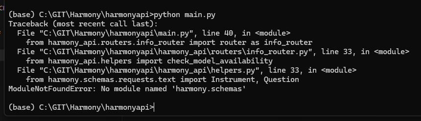

# Hackathon FAQs

## How can I register for the hackathon?
You can register using Eventbrite. https://www.eventbrite.co.uk/e/harmony-hackathon-tickets-887795278577 

## Who should register for the Hackathon? 
We appreciate coders with skills in Python or Node.js, or anyone with an interest in psychology, data science, natural language processing, or anyone with an idea to improve Harmony! 

## What do I need to bring?
Please bring your own laptop and anything you need to feel comfortable on that day. We will be providing wifi, snacks, food and drinks including water, tea and juice.

## How do I get there?
University College London, Room B02 in Chandler House, 2 Wakefield St, London WC1N 1PF
https://www.ucl.ac.uk/pals/contact/how-find-chandler-house

## How do I register on the day?
Please bring some ID with you to the event which we will check against registered attendees. Please ensure you have signed up prior to the event.

## What happens to the code we produce in the hackathon?
Any code produced and submitted to the main Harmony repository will be public under MIT license.

## How can I access the wifi?
Here are instructions for guests to access wifi: https://www.ucl.ac.uk/isd/how-to/connecting-to-uclguest-wi-fi-cloud

## I don’t have a team, can I still register?
Of course! We’ll get everyone into teams on the day. 

## How many people can attend?
There are limited spaces - we can accommodate up to 40 people, so make sure you register soon as we expect places to fill up fast. If you register and can no longer make it, please let us know so we can offer the space to someone else.

## Are there prizes?
Yes! There will be prizes available to winning teams and runners up of the day. Prizes will be judged and allocated on the day. More info on prizes and judging will be posted on our Github nearer the date.


## Troubleshooting the API repo submodules after git clone

After you have cloned the repository at https://github.com/harmonydata/harmonyapi, if the folder inside called `harmony` is empty, or at any point you get an error like the below, please check you have cloned with `--recurse-submodules` as below:



```
git clone --recurse-submodules https://github.com/harmonydata/harmonyapi.git
```

You can also download the entire API repo from https://harmonyapistorage.z33.web.core.windows.net/harmonyapi.zip
